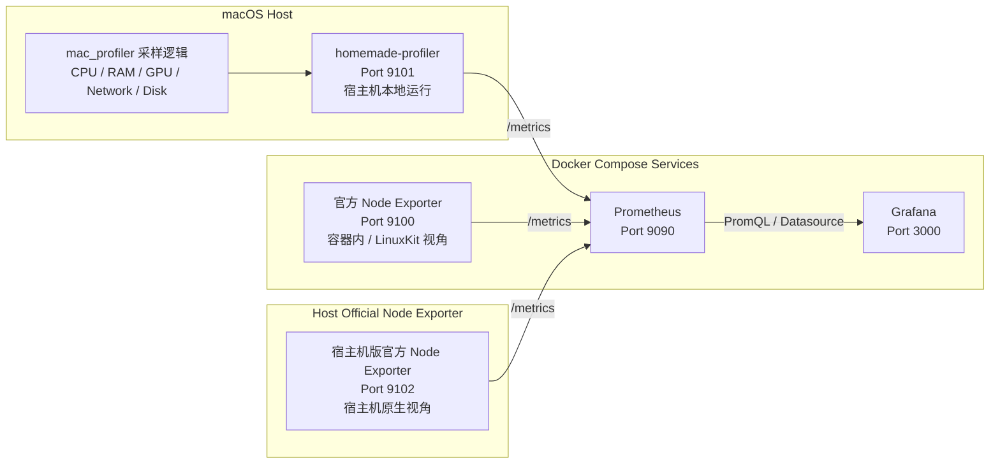

# Server Configuration

本文档说明当前项目里的所有服务是怎么配置的、分别运行在哪里、使用什么端口，以及它们之间的数据流关系。

## 总体说明

当前项目不是单一采集链路，而是两套采集并存：

- 一套是官方 `node exporter`
- 一套是自定义 `homemade-profiler`
- 一套是宿主机版官方 `node_exporter`

这样设计的原因是：

- 官方 `node exporter` 可以展示标准 Prometheus 生态接法
- 自定义 `homemade-profiler` 可以展示你自己的宿主机采样能力
- `Prometheus` 可以统一管理两套采集目标
- `Grafana` 可以统一展示它们的数据

## 架构图



## 服务划分

### 1. 官方 Node Exporter

- 服务名：`node-exporter`
- 运行方式：`docker compose`
- 端口：`9100`
- 类型：官方 Prometheus 生态组件
- 作用：展示标准 `node exporter` 接入方式

当前这个服务是通过 `docker-compose.yml` 启动的官方容器。

但要特别注意：

- 在当前 `macOS + Docker Desktop` 环境里
- 这个 `node exporter` 看到的主要是容器 / LinuxKit 视角
- 不是你这台 Mac 的真实宿主机原生视角

所以它的定位是：

- 有展示价值
- 有标准接入价值
- 但对“监控这台电脑本身”来说，数据价值有限

### 2. homemade-profiler

- 服务名：`homemade-profiler`，没有放进 compose
- 运行方式：宿主机本地直接运行
- 端口：`9101`
- 类型：自定义 Python / FastAPI 服务
- 作用：输出更接近真实宿主机的数据

这个服务会直接调用 `homemade-profiler/mac_profiler` 里的采样逻辑，包括：

- CPU
- 内存
- GPU
- 网络
- 硬盘

然后把这些结果转成 Prometheus 可以抓取的 `/metrics` 接口。

这套服务是当前项目里真正有业务价值的宿主机采集来源。

### 3. Prometheus

- 服务名：`prometheus`
- 运行方式：`docker compose`
- 端口：`9090`
- 类型：官方 Prometheus
- 作用：统一抓取和管理所有 exporter

当前 `Prometheus` 会同时抓两套目标：

- `node-exporter:9100`
- `host.docker.internal:9101`
- `host.docker.internal:9102`

也就是说，在 `Prometheus` 视角里，现在相当于管理三台“机器”：

- 一台是官方 exporter 机器
- 一台是自定义 exporter 机器
- 一台是宿主机版官方 exporter 机器

### 4. Grafana

- 服务名：`grafana`
- 运行方式：`docker compose`
- 端口：`3000`
- 类型：官方 Grafana
- 作用：统一展示 Prometheus 中的采集结果

Grafana 当前通过 provisioning 自动接入 `Prometheus` 数据源。

也就是说：

- 你打开 `Grafana`
- 实际看到的数据来自 `Prometheus`
- `Prometheus` 再去统一抓官方 `node exporter` 和自定义 `FastAPI exporter`

## 配置方式

### Docker Compose 管理的服务

由 `docker-compose.yml` 管理：

- `node-exporter`
- `prometheus`
- `grafana`

这些服务由 Docker 启动、停止、重启。

### 宿主机本地运行的服务

不由 `docker-compose.yml` 管理：

- `homemade-profiler`

它是直接在宿主机启动的本地进程。

当前启动方式是：

```bash
cd /Users/bizi/Desktop/GitHub/NodeExporter-Prometheus-Grafana/homemade-profiler
/opt/anaconda3/bin/python -m uvicorn app:app --host 0.0.0.0 --port 9101
```

## 数据流说明

当前数据流分成两条：

### 路线一：官方展示链路

1. Docker 中的官方 `node exporter` 运行在 `9100`
2. `Prometheus` 抓取 `9100/metrics`
3. `Grafana` 从 `Prometheus` 读取这套指标

这条路线主要用于展示标准官方接法。

### 路线二：真实宿主机采集链路

1. `homemade-profiler/mac_profiler` 里的本机采样逻辑读取宿主机状态
2. `homemade-profiler` 在 `9101` 暴露 `/metrics`
3. `Prometheus` 抓取 `9101/metrics`
4. `Grafana` 从 `Prometheus` 读取这套指标

这条路线才是当前项目里更有价值的宿主机监控链路。

## 端口说明

- `9100`：官方 `node exporter`
- `9101`：`homemade-profiler`
- `9102`：宿主机版官方 `node_exporter`
- `9090`：`Prometheus`
- `3000`：`Grafana`

## 访问方式与认证情况

### Grafana

- 地址：`http://127.0.0.1:3000`
- 当前认证方式：Grafana 默认登录
- 当前用户名：`admin`
- 当前密码：`admin`

这是当前默认状态。如果后续改了管理员密码，文档也需要同步更新。

### Prometheus

- 地址：`http://127.0.0.1:9090`
- 当前是否需要用户名密码：不需要
- 当前是否有登录页：没有
- 当前是否有额外认证：没有

### 官方 Node Exporter

- 地址：`http://127.0.0.1:9100/metrics`
- 当前是否需要用户名密码：不需要
- 当前是否有额外认证：没有

### 宿主机版官方 Node Exporter

- 地址：`http://127.0.0.1:9102/metrics`
- 当前是否需要用户名密码：不需要
- 当前是否有额外认证：没有

### homemade-profiler

- 地址：`http://127.0.0.1:9101/metrics`
- 健康检查：`http://127.0.0.1:9101/healthz`
- 当前是否需要用户名密码：不需要
- 当前是否有额外认证：没有

## 当前结论

当前项目不是简单地“做一个 node exporter”，而是做了两种 node 侧采集方式：

- 一种用于展示标准官方生态能力
- 一种用于展示你自己的宿主机采样与 exporter 封装能力

最终由 `Prometheus` 统一纳管，再由 `Grafana` 统一展示。

如果只谈“哪个更有用”，答案是：

- 官方 `9100` 更偏展示用途
- 自定义 `9101` 更偏真实宿主机监控用途
